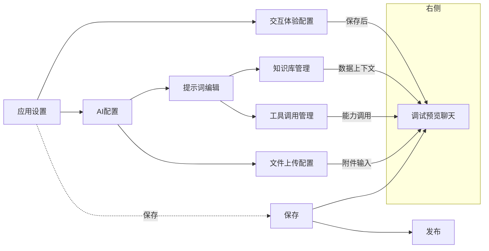
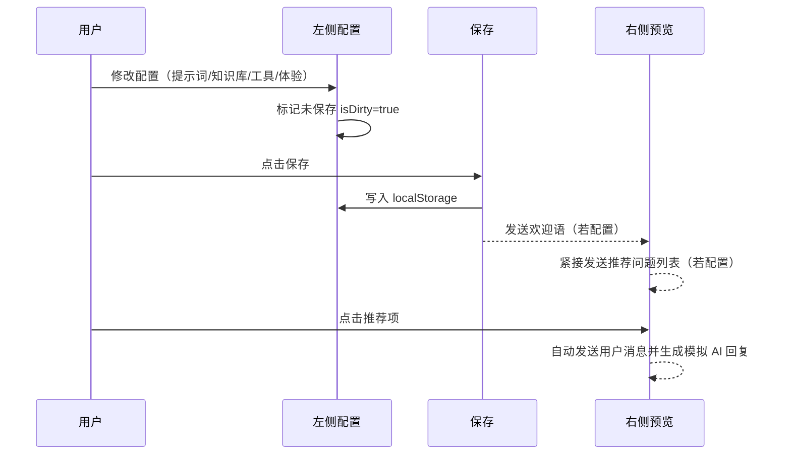
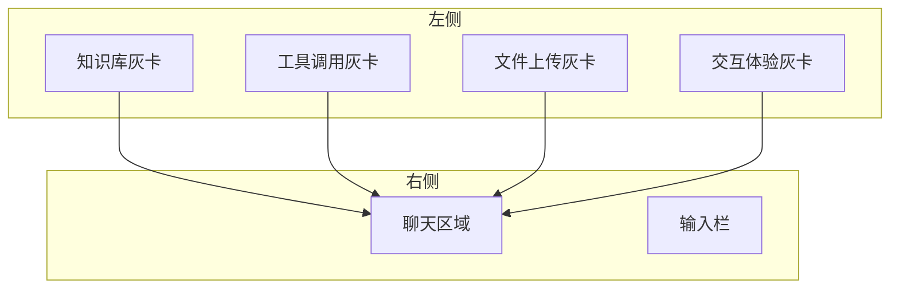
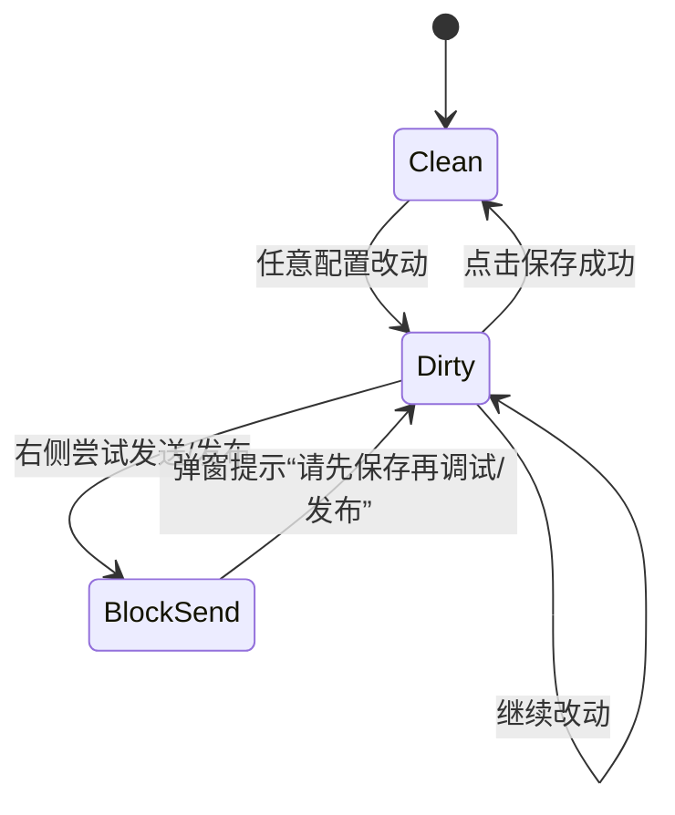

# 产品需求文档（PRD）

## 1. 功能概述

- 核心模块
  - 应用设置：应用名称、描述、图标管理和展示。
  - AI 配置：模型选择、回复长度、采样参数、温度等基础参数设置。
  - 提示词编辑：系统提示、对话风格与策略的编写与存储。
  - 知识库管理：FAQ、RAG、图谱三类知识条目的选择与检索参数设置（TopK、重排序模型、是否直出）。
  - 工具调用管理：工具集合的添加、启用/禁用、工具配置项的管理。
  - 文件上传配置：是否允许上传、上传类型（文档/图片）、数量上限等设置。
  - 交互体验配置：欢迎语、过程可见性、推荐问题、下一步推荐等用户体验选项。
  - 调试预览聊天：右侧聊天窗口，支持用户消息、AI 消息、图片消息、复制/重生成/删除等操作与布局切换。
  - 发布与保存：保存配置、发布应用与未保存拦截（“请先保存再调试/发布”）。

- 业务价值与用户场景
  - 面向产品经理与运营人员：以零/低代码的方式搭建可用的智能助手与知识问答系统，快速验证与迭代。
  - 面向开发者：提供可配置的工具/知识库/提示词，缩短集成周期，提高试错效率。
  - 面向演示与测试：右侧实时预览，便于在同一界面完成配置—保存—调试的闭环。

- 功能架构图



## 2. 功能详细说明

- 应用设置（`app_name`，`app_desc`，`app_icon`）
  - 目的与场景：设置应用基础信息用于顶部导航与发布展示。
  - 输入/输出：
    - 输入：名称、描述、图标文件。
    - 输出：本地存储键值；界面即时更新标题。
  - 业务规则：保存后清除未保存标记；名称必填（空值时使用占位）。
  - 异常处理：图标文件解析失败时忽略更新。

- AI 配置（`ai_model`，`ai_reply_limit`，`ai_top_p`，`ai_temperature`）
  - 场景：选择与调优大模型参数。
  - 输入/输出：表单项输入；保存写入本地存储；用于推理（预览中为模拟回复）。
  - 业务规则：参数范围校验（如 TopP 0–1，温度合理范围）。
  - 异常处理：非法值回退到默认值。

- 提示词编辑（`.panel .input` → `ux_config.welcome/visible/...` 结合使用场景）
  - 场景：编写系统提示词与风格策略。
  - 输入/输出：多行文本；保存后触发欢迎语与推荐问题在右侧发送。
  - 规则：修改即设为未保存（`isDirty=true`）；保存清除未保存并触发欢迎与推荐。

- 知识库管理（`kb_faq_list`，`kb_rag_list`，`kb_graph_list`，`kb_top_k`，`kb_rerank_model`，`kb_faq_direct`）
  - 场景：为问答提供上下文，配置检索参数。
  - 输入/输出：条目选择与参数输入；保存写入本地存储；右侧预览空态隐藏列表容器。
  - 规则：折叠状态与空列表共同控制可见性；删除操作影响已选计数。
  - 异常处理：JSON 解析失败采用空列表；缺省参数使用默认值。

- 工具调用管理（`tools`，`tool_config_*`）
  - 场景：添加工具、启用/禁用、配置参数。
  - 输入/输出：工具卡添加；开关切换；保存写入本地存储。
  - 规则：工具列表空态时不占位；启用计数=已启用数/总数。
  - 异常处理：重复添加忽略；配置解析失败采用空配置。

- 文件上传配置（`upload_config`）
  - 场景：限制上传类型与数量，上行数据用于辅助回答。
  - 输入/输出：开关、类型复选、数量上限；保存写入本地存储。
  - 规则：上传开关控制右侧预览的附件按钮显示；选中文档或图片时展示对应入口。
  - 异常处理：文件读取失败提示；超出数量上限阻止继续选择。

- 交互体验配置（`ux_config`：`welcome`、`visible`、`rec1/rec2/rec3`、`nextStep`）
  - 场景：初始化欢迎语与推荐问题，控制过程可见。
  - 输入/输出：文本与开关；保存后触发欢迎语与推荐问题消息发送。
  - 规则：
    - 保存后若设置了欢迎语，立即在右侧发送 AI 欢迎消息。
    - 保存后若设置了推荐问题，欢迎语之后再发送推荐问题列表；用户点击推荐项自动以用户身份发送并生成回复。
    - 右侧发送被未保存标记拦截：`请先保存再调试`。
  - 异常处理：空字符串不发送；点击推荐项时若输入框被禁用则仍追加消息。

- 调试预览聊天
  - 功能：用户输入、AI 模拟回复、图片消息、复制/重生成/删除按钮、布局切换、清空、消息对删。
  - 输入/输出：输入框文本与附件；输出为消息气泡，滚动到视底。
  - 规则：
    - 悬浮操作：AI/用户消息均显示复制、重生成、删除。
    - 删除成对逻辑：AI 与其前一个用户消息或用户与其后一个 AI 一并删除。
    - 布局规则：AI 悬浮按钮始终右侧；左右展示时用户按钮左侧，同侧布局则右侧。
  - 异常处理：空输入不发送；首次进入存在占位文案；复制失败静默。

- 发布与保存
  - 规则：
    - 未保存时发送/发布拦截并提示。
    - 保存后清除未保存标记并触发欢迎语与推荐问题消息。
  - 输出：提示弹窗；预览区域新增消息。

### 逻辑流程示意


### 2.x 功能细化说明

#### 2.1 应用设置（APP）
- 用户故事
  - 作为应用创建者，我需要设置名称、描述与图标，以便发布与识别。
- 操作点
  - 字段：`app_name`、`app_desc`、`app_icon`
  - 按钮：保存、发布、返回
- 交互流程
  - 修改任意字段 → 设为未保存 → 点击保存 → 同步到顶部导航名称/图标
- 校验与提示
  - 名称为空时以占位文案展示；保存成功弹窗“保存成功”
- 验收标准
  - 修改后不保存无法发布/发送；保存后导航文本即时更新

#### 2.1.1 主页名称/描述/头像编辑（HOME）
- 用户故事
  - 作为应用管理者，我希望在主页即可修改应用名称、描述与头像，确保展示一致且可发布。
- 操作点
  - 名称：可编辑文本，保存后用于顶部导航与主页显示。
  - 描述：可编辑多行文本，保存后用于主页简介区域。
  - 头像：点击上传图片（常见格式 PNG/JPEG），保存后用于主页与导航处展示。
- 交互流程
  - 修改任一项 → `isDirty=true` → 点击“保存” → 将 `app_name`、`app_desc`、`app_icon` 写入存储并更新主页/导航展示。
  - 未保存状态尝试“发送/发布” → 弹窗提示“请先保存再调试/发布”。
- 校验与提示
  - 名称去除首尾空格，空值时以占位文案显示（例如“未命名应用”）。
  - 头像文件解析失败则忽略更新，不阻断保存。
  - 保存成功弹窗“保存成功”。
- 验收标准
  - 刷新后主页仍显示最新名称、描述与头像（来源于本地存储）。
  - 未保存时“发送/发布”均被拦截；保存后允许。

#### 2.2 AI 配置（AI）
- 用户故事
  - 我需要选择与调优模型参数，以控制回答质量与风格。
- 操作点
  - 字段：`ai_model`、`ai_reply_limit`、`ai_top_p`、`ai_temperature`
  - 范围：`top_p ∈ [0,1]`、`temperature ∈ [0,2]`
- 交互流程
  - 参数调整 → 未保存标记 → 保存写入 → 右侧预览使用最新参数（当前为模拟回复）
- 校验与提示
  - 非法值回退默认；保存成功提示
- 验收标准
  - 保存后参数持久化；刷新页面仍能读取到最新配置

#### 2.3 提示词编辑（PROMPT）
- 用户故事
  - 我需要编写系统提示与风格，指导 AI 的行为。
- 操作点
  - 文本域：`.panel .input`（支持高度拖拽调整）
- 交互流程
  - 输入→未保存→保存→触发欢迎语与推荐问题在右侧发送
- 校验与提示
  - 空文本允许；保存后若 `welcome` 非空则发送欢迎语
- 验收标准
  - 保存即刻在右侧产生欢迎消息与推荐列表（若配置）

#### 2.4 知识库管理（KB）
- 用户故事
  - 我需要选择 FAQ/RAG/图谱条目，并设置检索参数，让回答基于上下文更准确。
- 操作点
  - 选择列表：`kb_faq_list`、`kb_rag_list`、`kb_graph_list`
  - 参数：`kb_top_k`、`kb_rerank_model`、`kb_faq_direct`
  - 折叠按钮：显示/隐藏内容区；空列表时内容区隐藏以保持卡片等高
- 交互流程
  - 选择/删除条目、调整参数 → 未保存 → 保存 → 计数更新
- 校验与提示
  - `top_k` 必须为正整数；删除立即反映到计数
- 验收标准
  - 空态时卡片高度与其他卡一致；保存后数据可持久化并正确渲染

- 选中与弹窗细节
  - 触发与关闭
    - 点击“+ 添加”打开弹窗（config.html:778-779、config.html:732）。
    - 点击遮罩、✕、取消关闭（config.html:781、config.html:779-780）。
  - 选择与参数
    - FAQ/RAG/图谱多选，菜单展开/收起与“已选 X 项”计数（config.html:1148-1156、config.html:1158-1160）。
    - 参数区包含重排序模型与 TopK、FAQ 直出开关；当有选项时必须设置有效模型与 TopK（config.html:1125-1131）。
  - 确认保存
    - 将选择与参数写入存储（config.html:1135-1141），清除错误文案（config.html:1133）。
    - 关闭弹窗并刷新列表，展开内容区（config.html:1143-1146），更新摘要计数（config.html:1194）。
  - 失败反馈
    - 未设置模型或 TopK 时在弹窗底部显示错误提示（config.html:1129-1131）。

#### 2.5 工具调用管理（TOOLS）
- 用户故事
  - 我需要添加工具并启用/禁用，供对话过程中被调用。
- 操作点
  - 列表：`tools`；配置：`tool_config_*`
  - 开关：每项工具的启用状态；计数：已启用/总数
- 交互流程
  - 从工具库添加 → 自动启用 → 未保存 → 保存 → 右侧显示能力入口（预览为模拟）
- 校验与提示
  - 重复添加忽略；删除更新计数
- 验收标准
  - 空态列表隐藏占位；启用计数准确；保存后持久化

- 选中与弹窗细节
  - 触发与关闭
    - 点击“+ 添加”打开工具弹窗（config.html:799、config.html:747）。
    - 点击遮罩、✕、取消关闭（config.html:835、config.html:833-834）。
    - 点击“确认”关闭（config.html:1005）。
  - 选择与添加
    - 在工具网格中点击“添加”将工具加入列表并默认启用（config.html:958-967）。
    - 工具行的启用开关可直接切换（config.html:995-1000）。
  - 信息与子弹窗
    - 点击“信息”按钮：图片回答工具进入专属弹窗配置（config.html:988-993、config.html:374-383）。
    - 图片回答弹窗确认后写入配置、将工具加入列表并展开（config.html:1017-1026、config.html:1027-1029）。
  - 刷新与计数
    - 渲染列表时更新“已启用/总数”摘要（config.html:940-942），并根据空态/折叠控制可见性（config.html:955、config.html:793-795）。

#### 2.6 文件上传配置（UPLOAD）
- 用户故事
  - 我希望控制是否允许上传，以及上传的类型与数量限制。
- 操作点
  - 开关：`upload_config.enabled`；类型：`types.doc/img`；数量：`max`
- 交互流程
  - 切换开关/类型/数量 → 未保存 → 保存 → 右侧显示/隐藏上传入口
- 校验与提示
  - 超过数量上限阻止选择；不支持类型不展示入口
- 验收标准
  - 保存后入口展示与隐藏符合配置；预览选择文件能产生用户图片/文件消息

- 选中与弹窗细节
  - 触发与关闭
    - 点击开关：关闭→直接关闭并保存；开启→打开弹窗补齐配置（config.html:812-823）。
    - 点击遮罩、✕、取消关闭（config.html:824-826）。
  - 弹窗操作
    - 同步修改滑条与数字输入的最大数量（config.html:857-858）。
    - 选择允许的类型（文档/图片）并写入配置（config.html:859-868）。
  - 确认保存与反馈
    - 确认后强制开启开关、保存配置、关闭弹窗、刷新右侧附件入口按钮（config.html:859-868、config.html:885-887）。
    - 标记未保存已处理（config.html:867-868）。

#### 2.7 交互体验配置（UX）
- 用户故事
  - 我需要设置欢迎语与推荐问题，优化首次交互体验，并控制过程可见性。
- 操作点
  - 字段：`welcome`、`rec1/rec2/rec3`、`visible`、`nextStep`
- 交互流程
  - 保存后若有欢迎语，立即发送 AI 欢迎；随后发送推荐问题列表（分行按钮）
  - 点击推荐项 → 自动发送用户消息 + 模拟 AI 回复
- 校验与提示
  - 空字符串不渲染推荐；点击推荐项无需焦点在输入框
- 验收标准
  - 保存后链式发送（欢迎→推荐）；空态列表隐藏、高度与其他卡一致

- 选中与弹窗细节
  - 触发与关闭
    - 点击“+ 添加”打开交互体验弹窗（config.html:832、config.html:773）。
    - 点击遮罩、✕、取消关闭（config.html:836-838）。
  - 弹窗操作
    - 欢迎语文本、过程可见性开关、3 个推荐问题输入与字符计数（config.html:1032-1033、config.html:456-481）。
  - 确认保存
    - 写入 `ux_config` 并关闭弹窗、刷新列表与展开（config.html:1034-1040）。
    - 顶部“保存”成功后会在右侧预览自动发送欢迎语与推荐问题链（config.html:904）。

#### 2.8 调试预览聊天（CHAT）
- 用户故事
  - 我希望在同页测试问答，包含复制、重生成、删除与布局切换。
- 操作点
  - 输入框：`.input-text`；消息操作：复制/重生成/删除；布局切换：左右/同侧
- 交互流程
  - 发送用户消息 → 生成模拟 AI 回复 → 悬浮操作可用；清空后显示占位文案
- 校验与提示
  - 删除成对逻辑：用户+其后 AI 或 AI+其前用户一并删除
- 验收标准
  - AI 悬浮按钮始终右侧；用户在左右布局时按钮左侧、同侧布局时右侧

#### 2.9 发布与保存（PUB）
- 用户故事
  - 我需要保存当前配置并发布；未保存时应被引导先保存。
- 操作点
  - 保存按钮：清除 `isDirty`；发布按钮：绿色区分
- 交互流程
  - 未保存点击发布/发送 → 弹窗提示；保存成功后允许发布/发送
- 验收标准
  - 文案统一；保存后触发欢迎/推荐链式消息

## 3. 用户界面说明

- 主要界面布局
  - 左：配置面板（若干灰卡片：知识库、工具调用、文件上传、交互体验）。
  - 右：调试预览（消息区 + 输入区）。

- 关键交互流程
  - 修改即未保存；保存后触发欢迎语/推荐问题；未保存拦截发送/发布。
  - 消息悬浮操作：复制/重生成/删除；删除成对；布局切换按钮用于同侧/左右布局切换。

- UI 组件与布局规范
  - 卡片：灰色背景、圆角、顶部标题与右侧操作；空态时列表容器隐藏确保高度一致。
  - 输入框：提示词为可拉伸文本域；右侧输入为自适应高度文本域。
  - 颜色：保存按钮主色；发布按钮绿色区分。

- 原型结构示意


## 4. 数据需求

- 数据实体
  - App：`app_name`、`app_desc`、`app_icon`
  - AIConfig：`ai_model`、`ai_reply_limit`、`ai_top_p`、`ai_temperature`
  - UXConfig：`ux_config`（`welcome`、`visible`、`rec1/rec2/rec3`、`nextStep`）
  - Tools：`tools` 数组、`tool_config_*`
  - KnowledgeBase：`kb_faq_list`、`kb_rag_list`、`kb_graph_list`、`kb_top_k`、`kb_rerank_model`、`kb_faq_direct`
  - UploadConfig：`upload_config`（`enabled`、`types.doc/img`、`max`）
  - ChatMessage（内存态）：用户/AI消息、图片、操作按钮状态

- 数据关系与流转
  - 左侧配置保存至 `localStorage` → 右侧读取并渲染；保存完成触发欢迎/推荐消息。
  - 工具与知识库的选择影响右侧调试上下文与能力展示（预览为模拟）。

- 字段定义示例
```json
{
  "ux_config": {
    "welcome": "欢迎使用智能助手",
    "visible": true,
    "rec1": "如何开始？",
    "rec2": "支持哪些文件？",
    "rec3": "如何发布？",
    "nextStep": false
  },
  "upload_config": {
    "enabled": true,
    "types": { "doc": true, "img": true },
    "max": 10
  },
  "tools": [
    { "id": "web-search", "name": "Web Search", "enabled": true }
  ]
}
```

## 5. 非功能性需求

- 性能
  - 响应时间：常规操作 < 100ms；列表渲染 < 200ms；大文件选择触发的预览生成 < 500ms。
  - 吞吐量：页面内为单用户本地交互，无并发瓶颈；后续对接后端时需限制接口 QPS。

- 安全性
  - 不存储密钥与敏感信息；`localStorage` 仅保存非敏感配置。
  - 文件选择不上传到远端（预览为本地对象 URL）；后续接入需遵守访问控制与合规。

- 兼容性
  - 浏览器：现代 Chromium/Firefox/Safari 最新两个大版本。
  - 视口：≥ 1280px 桌面优先；移动端可读但非重点。

- 可扩展性
  - 模块化：工具/知识库/上传/UX 以独立模块维护，便于增减。
  - 接口：预留与后端服务对接点，例如检索、工具执行、对话流。

## 6. 测试用例

- 保存拦截
  - 正常：修改后直接在右侧发送 → 弹窗提示“请先保存再调试”。保存后可发送。
  - 异常：未修改直接发送 → 正常发送并生成模拟回复。

- 欢迎与推荐
  - 正常：设置欢迎语与推荐问题，保存后右侧依次出现欢迎与推荐列表；点击推荐项自动发送并产生模拟回复。
  - 异常：推荐项为空或仅空格 → 不发送推荐列表。

- 消息操作
  - 复制：复制 AI/用户消息文本到剪贴板。
  - 重生成：基于对应用户消息生成新的 AI 模拟回复。
  - 删除：若为用户消息且后随 AI 消息，一并删除；若为 AI 消息且前有用户消息，一并删除。

- 布局与按钮位置
  - 同侧布局：用户悬浮按钮右侧；左右布局：用户悬浮按钮左侧；AI 始终右侧。

- 卡片高度一致性
  - 空态：知识库、工具调用、文件上传、交互体验四卡在空列表时高度一致。
  - 变更：添加条目后高度随内容增长，不出现额外占位。

- 上传入口显示
  - 开启上传：显示文档/图片入口；关闭上传：入口隐藏。

- 发布按钮规则
  - 未保存：发布提示“请先保存后再发布”。
  - 已保存：提示“发布成功”。

---

> 本文档以当前前端实现为基准，默认预览区为“模拟回复”。接入真实推理与检索服务后，需在“数据需求”“非功能性需求”“测试用例”部分补充服务端接口、鉴权与性能指标。

## 7. 术语与标识符

- 模块标识符
  - `APP`: 应用设置
  - `AI`: AI 配置
  - `PROMPT`: 提示词编辑
  - `KB`: 知识库管理
  - `TOOLS`: 工具调用管理
  - `UPLOAD`: 文件上传配置
  - `UX`: 交互体验配置
  - `CHAT`: 调试预览聊天
  - `PUB`: 发布与保存

- 前端状态键（localStorage）
  - `app_name`、`app_desc`、`app_icon`
  - `ai_model`、`ai_reply_limit`、`ai_top_p`、`ai_temperature`
  - `ux_config`、`upload_config`、`tools`、`tool_config_*`
  - `kb_faq_list`、`kb_rag_list`、`kb_graph_list`、`kb_top_k`、`kb_rerank_model`、`kb_faq_direct`

## 8. 状态与流程细化

### 8.1 未保存状态（isDirty）



- 触发改动的操作范围：模型选择、工具添加/开关/删除、上传配置修改、提示词输入、AI 参数、知识库选择/参数、UX 配置、应用名称/描述。
- 右侧发送逻辑：当 `isDirty=true` 时，调用发送函数直接弹窗并返回；发布同理。

### 8.2 欢迎与推荐触发

- 条件：保存后读取 `ux_config.welcome` 与 `ux_config.rec1/2/3`。
- 顺序：先发送欢迎语（若存在），再发送推荐问题列表（过滤空字符串）。
- 点击推荐项：自动生成一条用户消息与对应模拟 AI 回复；不依赖左侧是否焦点在输入框。

### 8.3 消息删除与重生成

- 成对删除规则：
  - 用户后跟 AI：删除用户与其下一条 AI。
  - AI 前有用户：删除 AI 与其前一条用户。
- 重生成：
  - 若当前行为 AI 行，依据相邻用户消息文本生成 “重新生成的回复”。
  - 若当前为用户行且后无 AI，则在其后插入新的 AI 行。

## 9. 用户界面规范细化

- 灰卡结构（知识库/工具调用/文件上传/交互体验）
  - 组成：左侧标题、右侧操作区（状态计数/添加/折叠按钮）、内容区（列表或开关）。
  - 空态：内容区隐藏以消除额外间距，保证四卡等高。
  - 间距：卡片内 `gap`≈10px；标题与内容区使用统一内边距。

- 颜色与按钮
  - `保存`：主色 `var(--primary)`；
  - `发布`：绿色 `#10b981`；
  - 禁用按钮：降低不透明度与取消悬浮态。

- 推荐问题渲染
  - 列表样式：纵向排列、单行按钮、悬浮下划线；点击即发送。

- 布局切换
  - 图标按钮触发左右/同侧布局；AI 操作始终右侧，用户操作在左右布局时位于左侧。

## 10. 数据字典（关键字段）

| 实体 | 字段 | 类型 | 约束 | 说明 |
|---|---|---|---|---|
| AIConfig | `ai_model` | string | 非空 | 模型名称（如 gpt-4o） |
| AIConfig | `ai_reply_limit` | number | 64–4096 | 最大回复 token/字数近似 |
| AIConfig | `ai_top_p` | number | 0–1 | 采样 top-p |
| AIConfig | `ai_temperature` | number | 0–2 | 采样温度 |
| UXConfig | `welcome` | string | 可空 | 保存后发送欢迎语 |
| UXConfig | `rec1/rec2/rec3` | string | 可空 | 推荐问题列表 |
| KB | `kb_top_k` | number | 1–50 | 检索条数 |
| KB | `kb_rerank_model` | string | 可空 | 重排序模型 ID |
| KB | `kb_faq_direct` | boolean | - | FAQ 是否允许直出 |
| Upload | `enabled` | boolean | - | 是否启用上传 |
| Upload | `types.doc/img` | boolean | - | 文档/图片类型开关 |
| Upload | `max` | number | 1–50 | 单次最大选择数 |

## 11. 错误与提示规范

- 提示文案
  - 未保存发送：**请先保存再调试**
  - 未保存发布：**请先保存后再发布**
  - 保存成功：**保存成功**
  - 发布成功：**发布成功**

- 错误处理
  - JSON 解析失败：回退到空对象或空数组，继续渲染。
  - 文件读取失败：弹窗提示，忽略该文件。
  - 推荐项为空：不渲染推荐列表。

## 12. 性能与容量细化

- 目标指标
  - 交互反馈：主要按钮点击到 UI 更新 < 100ms。
  - 列表渲染：常规 0–20 项 < 200ms；图片预览生成 < 500ms。
  - 本地存储写入：单次保存 < 50ms。

- 资源与容量
  - 图片预览：单图最大 10MB（对象 URL 预览）；建议压缩后使用。
  - 文档选择：合计不超过 `upload_config.max`；超出时阻止并提示。

## 13. 测试用例细化（示例格式）

```yaml
cases:
  - id: SEND_BLOCK_WHEN_DIRTY
    given: 配置已修改且未保存
    when: 点击右侧发送
    then: 弹窗“请先保存再调试”，不追加消息

  - id: WELCOME_AND_RECS_AFTER_SAVE
    given: welcome='你好'，rec1='A'，rec2='B'
    when: 点击保存
    then: 右侧新增AI欢迎消息；随后渲染A/B推荐项

  - id: RECOMMEND_CLICK_SENDS_USER
    given: 推荐项存在
    when: 点击推荐项'A'
    then: 右侧追加用户消息'A'与模拟AI回复

  - id: PAIRED_DELETE
    given: 用户后随AI或者AI前有用户
    when: 点击删除
    then: 两条成对删除
```

## 14. 风险与边界

- 预览区为模拟回复，真实效果取决于后端模型与检索服务接入情况。
- 本地存储非持久可靠数据源；清理浏览器或更换设备会丢失配置。
- 大量工具与知识条目会影响渲染性能；需分页或虚拟列表时另行设计。